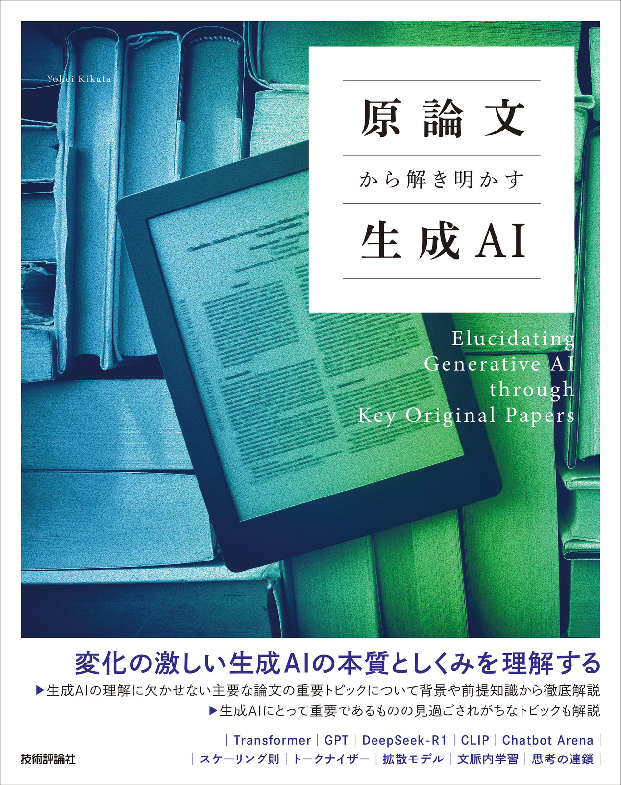

# 原論文から解き明かす生成AI サポートページ
技術評論社から発売された書籍「原論文から解き明かす生成AI」のサポートページです。  
書籍内の演習問題の解答や正誤表などを載せています。

技術評論社の書籍紹介ページ: [https://gihyo.jp/book/2025/978-4-297-15078-5](https://gihyo.jp/book/2025/978-4-297-15078-5)

  

## 演習問題の解答 
[exercises](./exercises) ディレクトリに章ごとの .md ファイルがあり、そこに演習問題の解答を記載しています。  
GitHub の数式のレンダリングの問題で見た目が少し分かりにくい部分（太字が太字になっていないなど）がありますが、ご了承ください。  
また、解答は一例に過ぎないものも多いので、ぜひより良い解答を考えてください。

## 正誤表
[errata.md](./errata.md) に随時追加していきます。

## このレポジトリへのコントリビュートに関して
[CONTRIBUTING.md](./CONTRIBUTING.md) をご確認ください。
