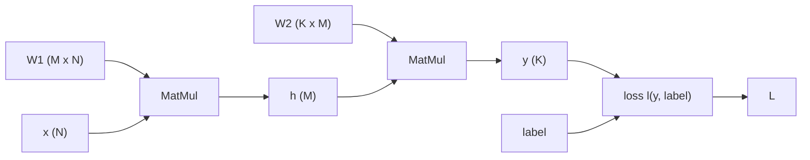

# 第7章 演習問題の解答

### 演習問題7.1
本書の図 7.2 に示されている結果を1つずつ確認していく。

まずは、Parameters の列に記載されているパラメーター数を確認しよう。
なお、層正規化のパラメーターは本書の式 (3.17) で示されているように $`\mathbb{R}^{d_{\mathrm{model}}}`$ で以下で現れるパラメーター数と比べると相対的に少ないので無視しており、同様に活性化関数に関しても無視している。

- Embed
  - トークンの埋め込み行列が $`\mathbb{R}^{n_{\mathrm{vocab}} \times d_{\mathrm{model}}}`$ で、学習可能な位置埋め込み行列が $`\mathbb{R}^{n_{\mathrm{ctx}} \times d_{\mathrm{model}}}`$ なので、合わせて $`(n_{\mathrm{vocab}} + n_{\mathrm{ctx}}) d_{\mathrm{model}}`$ となる。
- Attention: QKV
  - これは本書の 7.1.1. 項において解説されている。
- Attention: Mask
  - これは QKV が得られた後に score 関数や softmax を使って計算する部分を指している。マスク処理も score 関数の値を $`- \infty`$ という定数に置き換えて適用するもので新しいパラメーターはないため、新たなパラメーターは導入されない。
- Attention: Project
  - 注意層における出力の次元 $`d_{\mathrm{attn}}`$ を $`d_{\mathrm{model}}`$ に変換する行列が $`\mathbb{R}^{d_{\mathrm{attn}} \times d_{\mathrm{model}}}`$ でこれが層の数だけあるので $`n_{\mathrm{layer}} d_{\mathrm{attn}} d_{\mathrm{model}}`$ となる。
- Feedforward
  - 本書の式 (3.18) を見れば、主要な計算は $`d_{\mathrm{model}}`$ 次元の特徴量を $`d_{\mathrm{ff}}`$ に変換する行列 $`W_1 \in \mathbb{R}^{d_{\mathrm{model}} \times d_{\mathrm{ff}}}`$ を掛ける部分と、そこで得られた $`d_{\mathrm{ff}}`$ 次元の特徴量を再び $`d_{\mathrm{model}}`$ に変換する行列 $`W_2 \in \mathbb{R}^{d_{\mathrm{ff}} \times d_{\mathrm{model}}}`$ を掛ける部分である。これは $`2 d_{\mathrm{model}} d_{\mathrm{ff}}`$ であり、これが層の数だけあるので $`n_{\mathrm{layer}} 2 d_{\mathrm{model}} d_{\mathrm{ff}}`$ となる。
  - バイアス項の $`b_1 \in \mathbb{R}^{d_{\mathrm{ff}}}`$ や $`b_2 \in \mathbb{R}^{d_{\mathrm{model}}}`$ は相対的に無視可能である。
- De-embed
  - トークンの埋め込み行列の転置行列を使う想定であり、ここでは新たなパラメーターは導入されない。

次に、FLOPs per Token の列に記載されているトークン毎の演算量を確認しよう。

- Embed
  - トークン埋め込みと位置埋め込みの取得はテーブルからのルックアップ（学習した語彙の埋め込みを保存していてそれをインデックスに応じて取り出すだけ）なので計算量は無視できる。本書の式 (3.4) に基づくと、トークンの埋め込みに対して $`\sqrt{d_{\mathrm{model}}}`$ を掛ける処理が $`d_{\mathrm{model}}`$ FLOPs で、その後にトークン埋め込みと位置埋め込みを足す処理が $`d_{\mathrm{model}}`$ FLOPs で、$`2 d_{\mathrm{model}}`$ FLOPs となる。
  - 原論文では $`4 d_{\mathrm{model}}`$ FLOPs となっているが、これは上記のような正確な算出ではなく、おそらく他の処理と合わせるために、トークンの埋め込みを取得するのをトークンの埋め込み行列とインデックスに応じたワンホットベクトルの積と考えて（この場合は実際には和はないけど）積と和が発生して $`2 d_{\mathrm{model}}`$ で位置埋め込みも同様と考えていると思われる。実態に則してないので不適切だが、本書でも述べたようにスケーリング則では埋め込み層は除外するので影響はない。
- Attention: QKV
  - これは本書の 7.1.1. 項において解説されている。
- Attention: Mask
  - QKV が得られているので、本書の式 (3.12) の計算をマスク付きにした上であるトークン位置を抜き出せばよい（この式は全トークン位置の計算をまとめてするがいまの興味はトークンごとの FLOPs なので）。主要な計算の 1 つ目は行列積 $`Q K^{\mathsf{T}}`$ で、$`Q`$ のある行に注目すると、この計算は $`2 n_{\mathrm{ctx}} d_{\mathrm{attn}}`$ FLOPs となる。これはマスクを考慮してないのでマスクを考慮すると、$`i`$ 番目のトークンの場合は $`i + 1`$ 番目以降はマスク処理をするので計算する必要がなくなるので、必要な演算量は少なくなる。全部で $`n_{\mathrm{ctx}}`$ 個のトークン位置があるので、平均すると $`\frac{1}{n_{\mathrm{ctx}}} \sum_{i=1}^{n_{\mathrm{ctx}}} i \simeq \frac{n_{\mathrm{ctx}}}{2}`$ 個のクエリーとキーの計算が必要である。したがって、マスク付きの $`Q K^{\mathsf{T}}`$ に必要な演算量は $`n_{\mathrm{ctx}} d_{\mathrm{attn}}`$ FLOPs である。スケール化と softmax の演算量は相対的に無視できるので、同様に $`(Q K^{\mathsf{T}}) V`$（$`Q K^{\mathsf{T}}`$ は計算して $`\mathbb{R}^{n_{\mathrm{ctx}} \times n_{\mathrm{ctx}}}`$ の行列として扱う）の行列積の演算量も $`n_{\mathrm{ctx}} d_{\mathrm{attn}}`$ FLOPs である。これらを合わせて、層の数も考慮すると、演算量は $`2 n_{\mathrm{layer}} n_{\mathrm{ctx}} d_{\mathrm{attn}}`$ FLOPs となる。
- Attention: Project
  - これは単なる行列積なのでパラメーター数の議論から $`2 n_{\mathrm{layer}} d_{\mathrm{attn}} d_{\mathrm{model}}`$ となる。
  - 本書の図 7.2 は原論文から引用しているが、急に未定義の $`d_{\mathrm{embd}}`$ が出てくるがこれは誤りで正しくは $`d_{\mathrm{model}}`$ である。
- Feedforward
  - これは単なる行列積なのでパラメーター数の議論から $`2 n_{\mathrm{layer}} 2 d_{\mathrm{model}} d_{\mathrm{ff}}`$ となる。
- De-embed
  - $`d_{\mathrm{model}}`$ の特徴量にトークンの埋め込み行列の転置行列 $`\mathbb{R}^{d_{\mathrm{model}} \times n_{\mathrm{vocab}}}`$ を掛ける処理なので、演算量は $`2 d_{\mathrm{model}} \times n_{\mathrm{vocab}}`$ となる。

原論文の書き方がやや不適切だったり記号がおかしいところはあったが、提示されているパラメーター数とトークンごとの演算量が正しいことが分かった。

---

### 演習問題7.2
簡単な場合として、学習可能な行列を 2 回適用して損失を計算する場合を考えよう。
$`\boldsymbol{x} \in \mathbb{R}^{n}, W_1 \in \mathbb{R}^{m \times n}, W_2 \in \mathbb{R}^{k \times m}`$ と損失関数 $`\ell`$ を導入し、以下のように定義する。

- $`\boldsymbol{h} = W_1 \boldsymbol{x}`$
- $`\boldsymbol{y} = W_2 \boldsymbol{h}`$
- $`L = \ell (\boldsymbol{y}, \mathrm{label})`$



順伝播の演算量を考えよう。
$`W_1 \boldsymbol{x}`$ の計算は行列とベクトルの積なので $`2 n m`$ FLOPs で、$`W_2 \boldsymbol{h}`$ の計算も同様に $`2 m k`$ FLOPs となる。
$`L`$ の計算の演算量は典型的にはこれらの計算と比べると無視できる演算量なので無視しよう。

続いて逆伝播の演算量を考えよう。
重み $W_1, W_2$ の学習のために以下の勾配を計算する必要がある。

```math
\begin{align}
  \frac{\partial L}{\partial W_2} &=& \frac{\partial L}{\partial \boldsymbol{y}} \frac{\partial \boldsymbol{y}}{\partial W_2} \\
  \frac{\partial L}{\partial W_1} &=& \frac{\partial L}{\partial \boldsymbol{y}} \frac{\partial \boldsymbol{y}}{\partial \boldsymbol{h}} \frac{\partial \boldsymbol{h}}{\partial W_1} \\
\end{align}
```

これは行列とベクトルの表記で少し分かりづらいので、成分表記で書き下していく。
まず $`\frac{\partial L}{\partial W_2}`$ は以下となる。

```math
\begin{align}
  \frac{\partial L}{\partial W_{2,ij}} &=& \sum_{a=1}^{k} \frac{\partial L}{\partial y_a} \frac{\partial y_a}{\partial W_{2,ij}} \\
  &=& \sum_{a=1}^{k} \frac{\partial L}{\partial y_a} \frac{\partial \left( \sum_{b=1}^{m} W_{2,ab} h_b \right)}{\partial W_{2,ij}} \\
  &=& \sum_{a=1}^{k} \sum_{b=1}^{m} \frac{\partial L}{\partial y_a} \delta_{ai} \delta_{bj} h_b \\
  &=& \frac{\partial L}{\partial y_i} h_j
\end{align}
```

同様に、$`\frac{\partial L}{\partial W_1}`$ は以下となる。

```math
\begin{align}
  \frac{\partial L}{\partial W_{1,ij}} &=& \sum_{a=1}^{k} \sum_{b=1}^{m} \frac{\partial L}{\partial y_a} \frac{\partial y_a}{\partial h_b} \frac{\partial h_b}{\partial W_{1,ij}} \\
  &=& \sum_{a=1}^{k} \sum_{b=1}^{m} \sum_{c=1}^{m} \sum_{d=1}^{n} \frac{\partial L}{\partial y_a} \frac{\partial \left( W_{2,ac} h_c \right)}{\partial h_b} \frac{\partial \left( W_{1,bd} x_d \right)}{\partial W_{1,ij}} \\
  &=& \sum_{a=1}^{k} \sum_{c=1}^{m} \frac{\partial L}{\partial y_a} \frac{\partial \left( W_{2,ac} h_c \right)}{\partial h_i} x_j \\
  &=& \sum_{a=1}^{k} \frac{\partial L}{\partial y_a} W_{2,ai} x_j \\
\end{align}
```

これで必要な道具は揃ったので、$`\boldsymbol{x} \rightarrow \boldsymbol{h} \rightarrow \boldsymbol{y} \rightarrow L`$ という処理の流れの中での $`\boldsymbol{h}`$ に関わる計算の演算量に注目してみよう。
ここに注目するのは、層を増やしていった時に同じ構造として繰り返されるので、この部分の演算量が支配的となるためである。

順伝播の場合は、既に述べたように $`2 m k`$ FLOPs である。

逆伝播の場合、上流からの勾配を受け取って計算する処理と、下流で計算をするために勾配を計算して渡す処理と、2 つの計算が必要であることがポイントである。

まず、上流からの勾配を受け取って計算する部分は $`\frac{\partial L}{\partial W_{2,ij}} = \frac{\partial L}{\partial y_i} h_j`$ である。
$`\frac{\partial L}{\partial y_i}`$ というベクトルは（上流から計算していくので）上流の計算で得られており、$`h_j`$ というベクトルは順伝播の計算で得られている。
したがって、$`i,j`$ の全成分に関してこれらのベクトルの要素の積を取れば $`\frac{\partial L}{\partial W_{2,ij}}`$ は得られるので、$`k m`$ FLOPs となる。

次に、下流で計算をするために勾配を計算して渡す部分は $`\frac{\partial L}{\partial W_{1,ij}} = \sum_{a=1}^{k} \frac{\partial L}{\partial y_a} W_{2,ai} x_j`$ における $`\sum_{a=1}^{k} \frac{\partial L}{\partial y_a} W_{2,ai}`$ を $`i`$ の全成分に対して計算するということである。
こちらは要素の積に加えて $`a`$ について和を取る演算もあるので、$`2 k m`$ FLOPs となる。

これまでの結果を踏まえると、$`\boldsymbol{h}`$ に関わる計算で逆伝播に必要な演算量は $`3 k m`$ FLOPs となり、順伝播 $`2 k m`$ FLOPs の 1.5 倍である。
2 倍が期待する答えだったがそうなっていないのは、実はここまで考えてきた例はこの答えを導くのに不十分だったためである。

欠けていたピースは（ミニ）バッチを考慮することであり、これによって上流からの勾配を受け取って計算する部分は $`\frac{\partial L}{\partial W_{2,ij}} = \sum_{z=1}^b \frac{\partial L}{\partial y^{(z)}_i} h^{(z)}_j`$ となり、これはバッチに関して和を取る処理が追加されるので $`2 b k m`$ FLOPs となる。
他の演算は $`b`$ 倍されるだけなので、これにより逆伝播の演算量が順伝播の演算量の約 2 倍になることを示せた。

得たい結論を得るための最小限の例を作るということは時に思慮深さを求められるものであり、このような具体例を自分で構成して計算してみるのはよい勉強になる。

---

### 演習問題7.3
式 (7.1) の両辺に $`S_{\mathrm{min}} E_{\mathrm{min}}`$ を掛けてから $`E = BS`$ と $`E_{\mathrm{min}} = B_{\mathrm{crit}} S_{\mathrm{min}}`$ を代入して整理すると式 (7.4) が導ける。

```math
\begin{align}
  &(S - S_{\mathrm{min}}) (B S - B_{\mathrm{crit}} S_{\mathrm{min}}) = B_{\mathrm{crit}} S^2_{\mathrm{min}} \\
  \rightarrow &B S^2 - B_{\mathrm{crit}} S S_{\mathrm{min}} - B S S_{\mathrm{min}} + B_{\mathrm{crit}} S^2_{\mathrm{min}} = B_{\mathrm{crit}} S^2_{\mathrm{min}} \\
  \rightarrow &B_{\mathrm{crit}} S_{\mathrm{min}} + B S_{\mathrm{min}} = B S \\
  \rightarrow &S_{\mathrm{min}} = \frac{S}{1 + B_{\mathrm{crit}} / B} \\
\end{align}
```

ここで得られた結果の両辺に $`6 N B_{\mathrm{crit}}`$ を掛けて、$`C = 6 N B S`$ と $`C_{\mathrm{min}} = 6 N B_{\mathrm{crit}} S_{\mathrm{min}}`$ を使えば、式 (7.5) が導ける。

```math
\begin{align}
  C_{\mathrm{min}} &= \frac{6 N B_{\mathrm{crit}} S}{1 + B_{\mathrm{crit}} / B} = \frac{6 N B S}{B / B_{\mathrm{crit}} + 1} = \frac{C}{1 + B / B_{\mathrm{crit}}}
\end{align}
```

---

### 演習問題7.4
詳細は論文 [https://arxiv.org/abs/2211.04325v2](https://arxiv.org/abs/2211.04325v2) を読み解く必要があるが、ここではポイントだけかいつまんで解説する。
本書の図 7.8 中のウェブ上のテキストデータ量（Stock of data）とテキスト生成モデルの学習に使用するデータ量（Dataset size projection）は最終的に以下のようにモデル化されており、年 $`y`$ の関数となっている。 
これらの意味を理解していこう。

- ウェブ上のテキストデータ量（Stock of data）: $`S_{\mathrm{IW}} (y) = N_{\mathrm{IW}} B_P T_B (1 + g)^{y - y_0}`$
- テキスト生成モデルの学習に使用するデータ量（Dataset size projection）: $`F_D(y) = \frac{1}{2} (F_{D_H (y)} + F_{D_C (y)})`$

まずウェブ上のテキストデータ量を見よう。

$`N_{\mathrm{IW}}`$（$`\mathrm{IW}`$ は Indexed Web の略）はインデックス化されたウェブページをページ数でカウントしたものである。
Google にインデックスされたページ数を推定しており、これはかなり不確実性が大きいが、2,500 億ページ（95% 信頼区間で [1,000 億ページ, 1.2 兆ページ]）としている。
推定方法は論文の Appendix B に記載されているので詳しく知りたい場合は参照するとよい。
大雑把に言うと、RefinedWeb Dataset [https://arxiv.org/abs/2306.01116v1](https://arxiv.org/abs/2306.01116v1) という Common Crawl をフィルタリングして重複排除をしたデータセットにおける単語頻度をカウントして対数スケールにして等間隔に 100 単語取得し（RefinedWeb では全ページ数とこれらの単語を含むページ数の割合は計算できる）、その 100 単語で Google 検索をしてヒットしたページ数を取得して全体のページ数を推定している（単語頻度の分布は同じであると仮定している）。

$`B_P`$ は 1 ページあたりの平均プレーンテキストバイト数であり、これは Common Crawl を Indexed Web を代表していると仮定して推定して、7,000 バイト（95% 信頼区間で [6,100 バイト, 8,200 バイト]）としている。

$`T_B`$ は 1 バイトあたりの平均トークン数であり、これはトークナイザーによっても異なるので Appendix E で分析している。
トークナイザーで結果に大きな影響を及ぼすような差はなく、この論文では 1 トークンあたり 4 バイト（95% 信頼区間で [2 バイト, 5 バイト]）と推定しており、つまり 1 バイトあたりの平均トークン数は 0.25 である。

$`N_{\mathrm{IW}}`$ は年と共に変化すると想定されるが、その効果は $`(1 + g)^{y - y_0}`$ で取り込んでいる。
$`g`$ は年成長率で、$`y_0`$ は基準年で、どの数字を使っているかは明示されていないが 2023 もしくは 2024 であると思われる。
ここはかなり複雑で、Common Crawl のプレーンテキストの平均ページサイズは年率 2 ~ 4% で増えているが、先行研究 [https://pubmed.ncbi.nlm.nih.gov/27122648/](https://pubmed.ncbi.nlm.nih.gov/27122648/) では過去 10 年の Google のインデックス規模がほぼ一定とされており直感と反するようにも思われる。
そこで、世界の IP トラフィック・リンク切れ率・インターネット利用者数の増加を代理変数として見積もり、[0%, 10%] の範囲であるとしている（点推定の値は提示されていない）。

これまでの結果を使って $`y_0 = 2024`$ として $`y = 2024`$ の場合のウェブ上のテキストデータ量を推定すると、$`0.25 [\text{兆ページ}] \times 7,000 [\text{バイト/ページ}] \times 0.25 [\text{トークン/バイト}] = 437.5 [\text{兆トークン}]`$ であり、論文では 510 [兆トークン] としていて完璧には再現できていないが、概ね同じ程度になっている。

ここで話は終わりではなく、推定したいのはテキスト生成モデルの学習に利用できる有効なデータ量なので、データの質が低いものは除外する必要がある。
過去の研究などを踏まえて、重複排除済のデータに対して低品質のデータをフィルタする際に [10%, 40%] の範囲のデータが学習に有効であるとしている（点推定の値は提示されていない）。
また、同じデータを使って複数エポック学習することもあり、これは有効データ量を増やすため、この効果も考慮して過去の研究を踏まえて [3倍, 5倍] 有効データ量が増えるとしている（点推定の値は提示されていない）。

これらの効果を全て考慮すると、最終的に 図 7.8 の Stock of data の 2024 年の結果（点推定値で 300 [兆トークン] 程度）が得られる。

次にテキスト生成モデルの学習に使用するデータ量を見よう。
$`F_X`$ は確率変数 $`X`$ の累積分布関数であり、$`D_H (y), D_C (y)`$ はそれぞれ歴史的（Historical）な情報から推定する学習データ利用量と計算（Compute）資源を考慮した学習データ利用量である。

$`D_H (y)`$ は、2010 年から 2024 年までの 80 ほどの主要なテキスト生成モデルの学習量を対数化したものを回帰で推定しており、結果として $`D_H (y) = D(y_0) G_D^{y - y_0}`$ が得られている。
ここで、推定値は $`D(y_0) \sim 10 [\text{兆トークン}]`$（信頼区間は提示されていない）と $`G_D = 2.4`$（95% 信頼区間で [1.9, 3.0]）が与えられている。

$`D_C (y)`$ は先行研究の結果を組み合わせて $`D_C (y) = \sqrt{ \frac{20}{6} C_{\mathrm{min}}(y) }`$ としている。
$`C_{\mathrm{min}}(y)`$ は非営利研究機関である Epoch AI [https://epoch.ai/](https://epoch.ai/) が出している計算量予測のレポート [https://epoch.ai/blog/projecting-compute-trends](https://epoch.ai/blog/projecting-compute-trends) の Details of the simulations にある結果を用いている。
これをデータ量に対応づける際に、論文 [https://arxiv.org/abs/2203.15556v1](https://arxiv.org/abs/2203.15556v1)（いわゆる Chinchilla スケーリング則の論文）の結果を用いて、論文の Table 2 の結果から $`D \propto \sqrt{C_{\mathrm{min}}}`$ とパラメーターあたりのトークン数として論文の Table 1 の結果から $`20`$ が得られ、さらに本書の 7.1.1 項の結果を使うと $`\frac{C}{N D} \simeq 6 `$ でパラメーター $`\times`$ トークンあたりの学習演算量として $`6`$ FLOPs が得られるので、これらを組み合わせてトークン単位のデータ量と最適な学習時演算量とを結びつけている。
ここでの議論は論文とは記号の使い方が違う部分があるが、理解がしやすいように本書の表記に合わせている。

$`D_H (y), D_C (y)`$ がどのような関数になるかは論文の Figure 4 から引用した以下の図で確認することができる。


最終的にはこれらを平均して $`F_D(y) = \frac{1}{2} (F_{D_H (y)} + F_{D_C (y)})`$ としており、これをプロットしたものが本書の図 7.8 の Dataset size projection となる。

---

### 演習問題7.5
$`R_{\Theta, m} \in \mathbb{R}^{d \times d}`$ と $`\boldsymbol{x} \in \mathbb{R}^{d}`$ の積 $`R_{\Theta, m} \boldsymbol{x}`$ を考えよう。

もし $`R_{\Theta, m}`$ が疎行列でなく密行列であれば、この積の計算量は $`\mathcal{O} (d^2)`$ である。

実際には $`R_{\Theta, m}`$ は本書の式 (7.15) で定義される疎行列であるため、以下のように非ゼロ成分のみを取り出して効率的に計算することができる。

```math
\begin{align}
R_{\Theta, m} \boldsymbol{x} =
\begin{pmatrix}
   x_1 \\
   x_2 \\
   x_3 \\
   x_4 \\
   \vdots \\
   x_{d-1} \\
   x_d \\ 
\end{pmatrix}
\odot
\begin{pmatrix}
   \cos \ m \theta_1 \\
   \cos \ m \theta_1 \\
   \cos \ m \theta_2 \\
   \cos \ m \theta_2 \\
   \vdots \\
   \cos \ m \theta_{d / 2} \\
   \cos \ m \theta_{d / 2} \\
\end{pmatrix}
+
\begin{pmatrix}
   - x_2 \\
   x_1 \\
   - x_4 \\
   x_3 \\
   \vdots \\
   - x_{d} \\
   x_{d-1} \\ 
\end{pmatrix}
\odot
\begin{pmatrix}
   \sin \ m \theta_1 \\
   \sin \ m \theta_1 \\
   \sin \ m \theta_2 \\
   \sin \ m \theta_2 \\
   \vdots \\
   \sin \ m \theta_{d / 2} \\
   \sin \ m \theta_{d / 2} \\
\end{pmatrix}
\end{align}
```

これは RoPE の論文 [https://arxiv.org/abs/2104.09864v5](https://arxiv.org/abs/2104.09864v5) の式 (34) に対応している（論文では外積でよく使われる記号が用いられていて紛らわしいが、要素積である）。
この計算量は $`\mathcal{O} (d)`$ であり、$`\mathcal{O} (d^2)`$ だった計算量が線形計算量まで効率化されている。

---

### 演習問題7.6
RoPE の論文 [https://arxiv.org/abs/2104.09864v5](https://arxiv.org/abs/2104.09864v5) の 3.4.3 Long-term decay of RoPE の議論を追えばよい。

まず、本書の式　(7.16) において $`\boldsymbol{a} = W_{\mathrm{key}} \boldsymbol{h}_n, \boldsymbol{b} = W_{\mathrm{query}} \boldsymbol{h}_m`$ とすると、$`\boldsymbol{q}_m^{\mathsf{T}} \boldsymbol{k}_n = \boldsymbol{b}_m^{\mathsf{T}} R_{\Theta, n-m} \boldsymbol{a}_n`$ となり、これに式 (7.15) を使うと、以下のように 2 成分ごとに同じような組み合わせが繰り返されることが分かる。

```math
\begin{align}
  \boldsymbol{b}_m^{\mathsf{T}} R_{\Theta, n-m} \boldsymbol{a}_n =& \cos ((n-m) \theta_1) a_1 b_1 - \sin ((n-m) \theta_1) a_1 b_2 + \sin ((n-m) \theta_1) a_2 b_1 + \cos ((n-m) \theta_1) a_2 b_2 + \dots \\
  &+ \cos ((n-m) \theta_i) a_{2i} b_{2i} - \sin ((n-m) \theta_i) a_{2i} b_{2i+1} + \sin ((n-m) \theta_i) a_{2i+1} b_{2i} + \cos ((n-m) \theta_i) a_{2i+1} b_{2i+1} + \dots
\end{align}
```

このような周期的に変動する対象は複素空間で議論するという見通しがよくなる（これは典型的によく使われるテクニックである）ことが多いので、以下のように 2 成分ごとにまとめた複素数を定義しよう。

```math
\begin{align}
  z^a_{i} &=& a_{2i} + i a_{2i + 1} \\
  z^b_{i} &=& b_{2i} + i b_{2i + 1} \\
\end{align}
```

これを用いると、先ほどの和は以下の形に整理できる（実部を取っていることや $`z^b_i`$ の複素共役、$`e`$ の肩の符号などに注意されたい）。

```math
\begin{align}
  \boldsymbol{b}_m^{\mathsf{T}} R_{\Theta, n-m} \boldsymbol{a}_n = \Re \left[ \sum_{i=0}^{d/2 - 1} z^a_i (z^b_i)^* e^{i (m-n) \theta_i} \right]
\end{align}
```

新たな記号として $`h_i = z^a_i (z^b_i)^*`$ と $`S_i = \sum_{j=0}^{i-1} e^{i (m-n) \theta_j}`$ を導入する（$`S_i`$ はいかにも技巧的な導入だが理由は後で分かる）と、$`e^{i (m - n) \theta_i} = S_{i+1} - S_{i}`$ であることから、以下の形で書ける。

```math
\begin{align}
  \boldsymbol{b}_m^{\mathsf{T}} R_{\Theta, n-m} \boldsymbol{a}_n = \Re \left[ \sum_{i=0}^{d/2 - 1} h_i (S_{i+1} - S_i) \right]
\end{align}
```

この $`S_{i+1} - S_{i}`$ という差分と $`h_i`$ と積を取る形にしたかったのは、こうすると任意の数列 $`a_i, b_i`$ に対して成り立つ $`\sum_{i=0}^{N-1} a_i (b_{i+1} - b_i) = - \sum_{i=0}^{N-1} (a_{i+1} - a_i) b_{i+1} + a_N b_N - a_0 b_0`$ が適用でき（証明は単純なので省略）、さらに $`h_{d/2} = 0, S_0 = 0`$ とすると、以下の形に変形できる。

```math
\begin{align}
  \boldsymbol{b}_m^{\mathsf{T}} R_{\Theta, n-m} \boldsymbol{a}_n = \Re \left[ - \sum_{i=0}^{d/2 - 1} (h_{i+1} - h_i) S_{i+1} \right]
\end{align}
```

ここまで来れば、あとは両辺の絶対値を取って不等式で上から抑えていくと意図が見えてくる。

```math
\begin{align}
  | \boldsymbol{b}_m^{\mathsf{T}} R_{\Theta, n-m} \boldsymbol{a}_n | &=& \left| \Re \left[ - \sum_{i=0}^{d/2 - 1} (h_{i+1} - h_i) S_{i+1} \right] \right| \\
  &\leq& \left| \sum_{i=0}^{d/2 - 1} (h_{i+1} - h_i) S_{i+1} \right| \\
  &\leq& \sum_{i=0}^{d/2 - 1} \left| h_{i+1} - h_i \right| \left| S_{i+1} \right| \\
  &\leq& \left( \max_i \left| h_{i+1} - h_i \right| \right) \sum_{i=0}^{d/2 - 1} \left| S_{i+1} \right| \\
\end{align}
```

典型的には、$`h_i`$ はそれほど急激には変化しないので、$`\sum_{i=0}^{d/2 - 1} \left| S_{i+1} \right|`$ の評価が重要で、$`S_{i+1} = \sum_{j=0}^{i} e^{i (m-n) \theta_j}`$ であったので、これは $`\theta_i = 10000^{-2i / d}`$ で $`m-n`$ が大きくなればなるほど早く振動するようになって各項が打ち消しあって小さくなるものと期待される。
このような、早く振動して打ち消し合うという形になるように式変形をしてきたわけである。
論文ではこれを数値的に確かめており、パラメーター $`d`$ の影響を除けるように $`\frac{2}{d} \sum_{i=0}^{d/2 - 1} \left| S_{i+1} \right|`$ を縦軸、$`m-n`$ を横軸にした結果が以下であり、確かに減衰していくことが分かる（論文の Figure 2 より引用）。


---

### 演習問題7.7
実装 [https://github.com/deepseek-ai/DeepSeek-V3/blob/2f7b80e/inference/model.py](https://github.com/deepseek-ai/DeepSeek-V3/blob/2f7b80e/inference/model.py) の中の特に `MLA` クラスを読み解いていけばよい。
かなり多くの変数や分散処理に関する記述や技巧的な記述があるので、読み解くには少し気合が必要である。

`forward` メソッドを読み進めて本書の記述と対応づけていこう。
まず、以下の部分は `self.q_lora_rank` でクエリーの特徴量を潜在空間に射影するかどうかをコントロールできるようになっているが、本書では潜在空間を使う場合の説明をしていたので、これは非ゼロの場合を考える。
この処理において、`self.wq_a(x)` が式 (7.17) の $`\boldsymbol{c}_t^Q`$（トークン位置 $`t`$ のすべての要素が含まれている点は異なる。以降の議論でも同様である。）に対応している。
`self.q_norm()` は本書（原論文）には登場しなかった要素だが、実装では層正規化が適用されている。
`self.wq_b()` そのものは対応する式はないが、式 (7.18) の $`\boldsymbol{q}_t^C`$ と式 (7.19) の $`\boldsymbol{q}_t^R`$ の基となるものである。

```python
        if self.q_lora_rank == 0:
            q = self.wq(x)
        else:
            q = self.wq_b(self.q_norm(self.wq_a(x)))
```

続いて、以下の部分の処理で、`q_nope` が式 (7.18) の $`\boldsymbol{q}_t^C`$ に対応するもので、`q_pe` が式 (7.19) の $`\boldsymbol{q}_t^R`$ に対応するものである。
クエリー部分は比較的シンプルでこれで終了である。

```python
        q_nope, q_pe = torch.split(q, [self.qk_nope_head_dim, self.qk_rope_head_dim], dim=-1)
        q_pe = apply_rotary_emb(q_pe, freqs_cis)
```

キーとバリューに関しては、以下の部分で `kv` が式 (7.21) の $`\boldsymbol{c}_{t (\mathrm{cached})}^{KV}`$ に対応するもので、`k_pe` が式 (7.23) の $`\boldsymbol{k}_{t (\mathrm{cached})}^{R}`$ に対応するものである。

```python
        kv = self.wkv_a(x)
        kv, k_pe = torch.split(kv, [self.kv_lora_rank, self.qk_rope_head_dim], dim=-1)
        k_pe = apply_rotary_emb(k_pe.unsqueeze(2), freqs_cis)
```

ここから実装が分岐し、`naive` の方は素朴な実装だがキャッシュのメモリ量や計算量が大きくなるため、ここでは割愛し、`naive` でない場合の実装を見よう。

```python
            wkv_b = self.wkv_b.weight if self.wkv_b.scale is None else weight_dequant(self.wkv_b.weight, self.wkv_b.scale, block_size) 
            wkv_b = wkv_b.view(self.n_local_heads, -1, self.kv_lora_rank)
            q_nope = torch.einsum("bshd,hdc->bshc", q_nope, wkv_b[:, :self.qk_nope_head_dim])
            self.kv_cache[:bsz, start_pos:end_pos] = self.kv_norm(kv)
            self.pe_cache[:bsz, start_pos:end_pos] = k_pe.squeeze(2)
            scores = (torch.einsum("bshc,btc->bsht", q_nope, self.kv_cache[:bsz, :end_pos]) +
                      torch.einsum("bshr,btr->bsht", q_pe, self.pe_cache[:bsz, :end_pos])) * self.softmax_scale
```

まず、`wkv_b` は式 (7.22) の $`W^{UK}`$ と $`W^{UV}`$ を合わせた重みである。
`q_nope` の処理は、この重みのうち $`W^{UK}`$ のみを取り出し、クエリ側に適用することで $`(W^{UK})^{\mathsf{T}} \boldsymbol{q}_t^{C} \in \mathbb{R}^{d_c}`$ を得ている。
これにより、位置埋め込みのない $`\boldsymbol{q}_t^{C}`$ の次元を大きな $`d_h n_h`$ から小さな $`d_c`$ へと変換し、後で実施するスコアの計算が効率的になる（計算量や帯域を小さく抑えられる）。

また、`self.kv_cache` と `self.pe_cache` はそれぞれ式 (7.21) の $`\boldsymbol{c}_{t (\mathrm{cached})}^{KV}`$ と式 (7.23) の $`\boldsymbol{k}_{t (\mathrm{cached})}^{R}`$ をキャッシュしている（キーとバリューにおける `kv_norm()` は本書（原論文）には登場していない）。
これはナイーブな実装と比べて、特に `kv` に関して潜在空間のものを保持するようになっているので、メモリを節約できる。

`scores` の計算は位置埋め込みがない要素とある要素で分けて計算をしており、本書の記述に合わせるなら前者が $`((W^{UK})^{\mathsf{T}} \boldsymbol{q}_t^{C})^{\mathsf{T}} \boldsymbol{c}_{t (\mathrm{cached})}^{KV}`$ で後者が $`(\boldsymbol{q}_t^R)^{\mathsf{T}} \boldsymbol{k}_{t (\mathrm{cached})}^{R}`$（ただし $`\boldsymbol{k}_{t (\mathrm{cached})}^{R}`$ は式 (7.24) で言及しているようにヘッドの数だけ複製したもの）である。

残りは Softmax を計算して、出力部分の線形変換を適用する部分である。
式 (7.26) の注意機構の計算は `naive` 実装を表現したものであり、実装上は効率的にするために複雑な処理をしていることが分かる。

```python
        scores = scores.softmax(dim=-1, dtype=torch.float32).type_as(x)
        if attn_impl == "naive":
            x = torch.einsum("bsht,bthd->bshd", scores, self.v_cache[:bsz, :end_pos])
        else:
            x = torch.einsum("bsht,btc->bshc", scores, self.kv_cache[:bsz, :end_pos])
            x = torch.einsum("bshc,hdc->bshd", x, wkv_b[:, -self.v_head_dim:])
        x = self.wo(x.flatten(2))
        return x
```

一読するだけではなかなか理解が難しいところではあると思うが、気合を入れて読む価値があるおもしろさがある。

---

### 演習問題7.8
本書の式 (7.32) から (7.35) までの性質を考えればよく、特に式 (7.33) にある指示関数の中身が重要で、$`s_{i,t}`$ の値が上位 $`K_r`$ 個であれば $`f_i`$ に寄与（損失が大きくなる方向に効く）し、そうでなければ寄与しない（損失が大きくならない）という点に注意されたい。

このことから、式 (7.32) の最大値を実現するためには、上位 $`K_r`$ 個に選ばれる expert の寄与のみが存在し、それ以外の expert の寄与はゼロになる状況であることが分かる。

具体的な構成として、より極端な場合として 1 つ目の expert のみが $`s_{1,t} = 1 , \forall t`$ でそれ以外の expert は $`s_{j,t} = 0 \ (j \neq 1), \forall t`$ を考えよう。
このとき、$`s'_{i,t} = s_{i,t}`$ で、$`P_1 = 1, P_{j} = 0 (j \neq 1)`$ となる。

$`f_i`$ に関しては、損失への寄与が $`f_i P_i`$ の形で現れるので $`f_1`$ のみを考慮すれば十分で、$`s_{1,t}`$ は定義によりどのトークン位置 $`t`$ においても常に上位 $`K_r`$ 個に含まれるため、以下のように計算される。

```math
\begin{align}
  f_1 = \frac{N_r}{K_r T} \sum_{t=1}^{T} \mathbb{I} (s_{1,t} \in \mathrm{TopK}(\{s_{j,t} \mid 1 \leq j \leq N_r\}, K_r)) = \frac{N_r}{K_r T} \sum_{t=1}^{T} 1 = \frac{N_r}{K_r}
\end{align}
```

したがって、損失の最大値として以下が得られる。

```math
\begin{align}
  L_{\mathrm{aux}} = \alpha \sum_{i=1}^{N_r} f_i P_i = \alpha f_1 P_1 = \alpha \frac{N_r}{K_r}
\end{align}
```

次に最小値を取る場合を考えよう。
ナイーブに考えれば、最大値を取る場合と対照的に、すべての expert が等しく取り扱われればよい $`s_{i,t} = 1, \forall i, \forall t`$ と考えられる。

このとき、$`s'_{i,t} = \frac{1}{N_r}, \forall i, \forall t`$ で、$`P_i = \frac{1}{N_r}, \forall i`$ となる。
$`f_i, \forall i`$ は指示関数が、条件が $`N_r`$ 個の同じ値を持つ要素から上位 $`K_r`$ 個を取ることになるのでランダムに取得するとして、確率 $`\frac{K_r}{N_r}`$ で $`1`$ を返すので、以下のように計算される。

```math
\begin{align}
  f_i = \frac{N_r}{K_r T} \sum_{t=1}^{T} \mathbb{I} (s_{i,t} \in \mathrm{TopK}(\{s_{j,t} \mid 1 \leq j \leq N_r\}, K_r)) = \frac{N_r}{K_r T} \sum_{t=1}^{T} \frac{K_r}{N_r} = 1
\end{align}
```

したがって、損失の最小値として以下が得られる。

```math
\begin{align}
  L_{\mathrm{aux}} = \alpha \sum_{i=1}^{N_r} f_i P_i = \alpha \sum_{i=1}^{N_r} \frac{1}{N_r} = \alpha
\end{align}
```

すっきりとした解が得られたが、実はこの最小値の議論は正しくない。
これはあるトークン位置 $`t`$ における $`\{ s'_{1,t}, \dots, s'_{N_r,t} \}`$ の上位 $`K_r`$ 個の値の合計が最小であるという条件を加えれば厳密に最小値になるが、この条件に特に妥当性はないため、より小さい値を取ることができる（TopK に頻繁に入る $`f_i`$ が大きい expert は各トークン位置で TopK に入る場合は $`P_i`$ が小さくなるように、TopK に入りにくい $`f_i`$ が小さな expert は TopK に入らない場合に $`P_i`$ が大きくなるように、という状況になれば損失がより小さくなる）。
本演習問題ではこれ以上立ち入らないので、興味のある読者は具体的に構成してみて欲しい。

---

### 演習問題7.9
原論文 [https://arxiv.org/abs/2201.11903v6](https://arxiv.org/abs/2201.11903v6) には質問応答のタスクについても様々な例が載っているが、ここでは StrategyQA という、論文 [https://arxiv.org/abs/2101.02235v1](https://arxiv.org/abs/2101.02235v1) で提案された多段階の推論を必要とするタスクの例を見よう。

以下が原論文の Table 16 より引用したもので、モデル（LaMDA 137B）が正解した場合と不正解だった場合がそれぞれ 2 つずつ提示されている。


正解例の 1 つ目はエクソシストが大脳辺縁系を刺激するかという問題に対して、エクソシストはホラー映画 → ホラー映画は怖い → 大脳辺縁系は恐怖に関与している（構成要素の 1 つである扁桃体は恐怖や不安などの感情の処理と記憶に重要な役割を担っている）→ エクソシストは大脳辺縁系を刺激する、という多段階の推論を適切に実施していることが分かる。
正解例の 2 つ目はそれぞれの画家の生まれた年代を考慮して師事が不可能であることを正しく推論している。

不正解例の 1 つ目は期待する答えは no であるが、ハリーポッターは架空のキャラクターだからなんでもできる（だから航空券も予約できる）と回答しており、出題意図とは異なりつつもこういう屁理屈っぽいことを言う人もいるよなと思わせる回答である。
一方で不正解例の 2 つ目は、明確に推論としては不適当（ソフィストとは説得の技術に長けた人物 → エペは剣の種類 → だからソフィストはエペを使える）なものとなっている。


---

### 演習問題7.10
再現実装の報酬を定義しているコード [https://github.com/huggingface/open-r1/blob/88a1b00/src/open_r1/rewards.py](https://github.com/huggingface/open-r1/blob/88a1b00/src/open_r1/rewards.py) は各報酬を関数として定義しており、これを読み解いていけばよい。
ちなみに、ここで定義した報酬は trl (Transformer Reinforcement Learning) というライブラリで実装されている GRPO Trainer クラス [https://github.com/huggingface/trl/blob/19f9b9e/trl/trainer/grpo_trainer.py](https://github.com/huggingface/trl/blob/19f9b9e/trl/trainer/grpo_trainer.py) に渡される。

報酬で定義されているものとそのポイントは以下である。

- `accuracy_reward`
  - 数学の問題の正誤一致による報酬で、正答なら 1.0 で誤答なら 0.0 となる。解答データとモデル出力の文字列を [https://github.com/huggingface/Math-Verify](https://github.com/huggingface/Math-Verify) というライブラリで比較して同じか否かを判定をする。正しい LaTeX 表記になっていることが要求されている。
- `format_reward`
  - 出力のフォーマットによる報酬で、モデル出力の文字列が `r"^<think>\n.*?\n</think>\n<answer>\n.*?\n</answer>$"` なるパターンであれば 1.0 でそうでなければ 0.0 となる。本書の図 7.20 でも登場したフォーマットである。
- `tag_count_reward`
  - 上記のフォーマットによる報酬を少し緩くした報酬で、`<think>\n`, `\n</think>\n`, `\n<answer>\n`, `\n</answer>` のそれぞれが一度だけ出現した場合はそれぞれ 0.25 加算してそうでなければ 0.0 加算される（2 回以上出現しても 0.0）。報酬は $`\{0, 0.25, 0.50, 0.75, 1.0\}`$ となる。
- `reasoning_steps_reward`
  - 段階的推論のステップを表示することによる報酬で、`r"(Step \d+:|^\d+\.|\n-|\n\*|First,|Second,|Next,|Finally,)"` の文字列の出現回数をカウントし、 `min(1.0, count / 3)` で報酬を設定する。3 は 3 ステップ以上に促すように設定したマジックナンバーである。
- `len_reward`
  - 文字数の長さによる報酬で、短い回答が好まれるようにする。バッチ内のモデルの出力の長さで比較して、正答の場合は [-0.5, 0.5]（正答でも回答が長ければ負になり得る）で誤答の場合は [-0.5, 0] となる。
- `get_cosine_scaled_reward`
  - 上記の文字数の長さによる報酬を cosine でスケールしたもので、正答の場合は [0.5, 1.0] で誤答の場合は [-1.0, -0.5] となる。具体的な計算は後で確認する。
- `get_repetition_penalty_reward`
  - モデル出力の文字列を空白区切りで単語分割した上で n-gram を構築し、ユニークな n-gram の数が少なくなるほど大きな負の報酬 [`max_penalty`, 0.0]（`max_penalty` はパラメーターで負の実数、n-gram の `n` もパラメーター）が与えられる。数式は $`\mathrm{max\_penalty} \times \left( 1 - \frac{\text{ユニークな n-gram の数}}{\text{全 n-gram の数}} \right)`$ で与えられる。
- `code_reward`
  - モデル出力の Python のコードをサンドボックス環境で実行（[https://github.com/e2b-dev/code-interpreter](https://github.com/e2b-dev/code-interpreter)を使用している）し、与えられたテストケースをどれだけパスしたか（passed / total）という報酬で、[0.0, 1.0] となる。
- `get_code_format_reward`
  - 出力のフォーマットによる報酬で、モデル出力の文字が `rf"^<think>\n.*?\n</think>\n<answer>\n.*?```{language}.*?```.*?\n</answer>$"` なるパターンであれば 1.0 でそうでなければ 0.0 となる。フェンスされたコードブロックが適切に出力されているかを判定している。

具体的なコードとして、`get_cosine_scaled_reward` の報酬の定義を見てみよう。

```python
def get_cosine_scaled_reward(
    min_value_wrong: float = -1.0,
    max_value_wrong: float = -0.5,
    min_value_correct: float = 0.5,
    max_value_correct: float = 1.0,
    max_len: int = 1000,
):
    def cosine_scaled_reward(completions, solution, **kwargs):
        """Reward function that scales based on completion length using a cosine schedule.

        Shorter correct solutions are rewarded more than longer ones.
        Longer incorrect solutions are penalized less than shorter ones.

        Args:
            completions: List of model completions
            solution: List of ground truth solutions

        This function is parameterized by the following arguments:
            min_value_wrong: Minimum reward for wrong answers
            max_value_wrong: Maximum reward for wrong answers
            min_value_correct: Minimum reward for correct answers
            max_value_correct: Maximum reward for correct answers
            max_len: Maximum length for scaling
        """
        contents = [completion[0]["content"] for completion in completions]
        rewards = []

        for content, sol in zip(contents, solution):
            gold_parsed = parse(sol, extraction_mode="first_match", extraction_config=[LatexExtractionConfig()])
            if len(gold_parsed) == 0:
                rewards.append(1.0)  # Skip unparseable examples
                print("Failed to parse gold solution: ", sol)
                continue

            answer_parsed = parse(
                content,
                extraction_config=[
                    LatexExtractionConfig(
                        normalization_config=NormalizationConfig(
                            nits=False,
                            malformed_operators=False,
                            basic_latex=True,
                            equations=True,
                            boxed=True,
                            units=True,
                        ),
                        boxed_match_priority=0,
                        try_extract_without_anchor=False,
                    )
                ],
                extraction_mode="first_match",
            )

            is_correct = verify(answer_parsed, gold_parsed)
            gen_len = len(content)

            # Apply cosine scaling based on length
            progress = gen_len / max_len
            cosine = math.cos(progress * math.pi)

            if is_correct:
                min_value = min_value_correct
                max_value = max_value_correct
            else:
                # Swap min/max for incorrect answers
                min_value = max_value_wrong
                max_value = min_value_wrong

            reward = min_value + 0.5 * (max_value - min_value) * (1.0 + cosine)
            rewards.append(float(reward))

        return rewards

    return cosine_scaled_reward
```

まずは `accuracy_reward` と同様に正誤判定をしている。
cosine でのスケールのために $`\alpha = \cos \left( \frac{\text{モデルの出力文字列長}}{1000} \pi \right)`$ という量を定義する。
$`\alpha`$ はモデルの出力が短いほど $`1`$ に近づき、長いほど $`-1`$ に近づく量である。
これらを用いて、正答と誤答の場合でそれぞれ以下のように報酬を設定している（`len_reward` とは異なり、誤答の場合は出力文字列長が短いほどペナルティが大きくなる設計になっている点に注意されたい）。

```math
\begin{align}
  \text{正答: }& \frac{1}{2} + \frac{1}{4} (1 + \alpha) \in [0.5, 1.0] \\
  \text{誤答: }& - \frac{1}{2} - \frac{1}{4} (1 + \alpha) \in [-1.0, -0.5]
\end{align}
```

様々な報酬関数が設定されていておもしろく、報酬には色々と工夫ができそうなのがおもしろいところである。
コードを読んでみると様々な参考情報を参照して報酬関数を構築している（例えば、`len_reward` は Kimi 1.5 report [https://arxiv.org/abs/2501.12599v4](https://arxiv.org/abs/2501.12599v4) を参照している）ことが分かるのもおもしろいところである。

